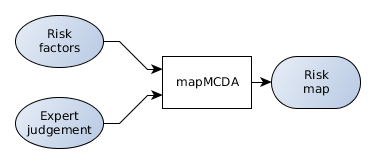
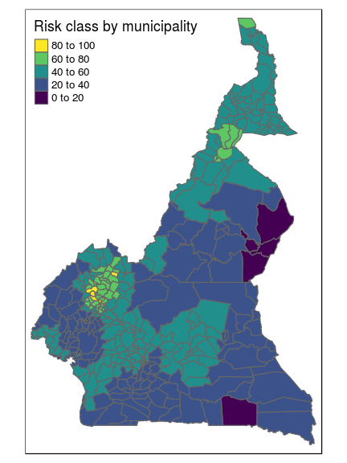
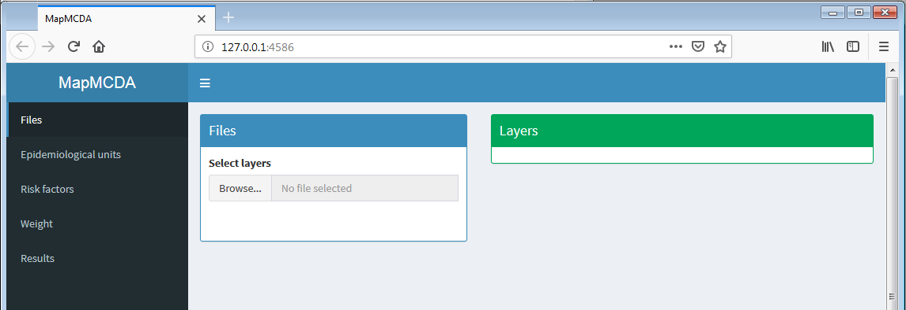

[](https://cran.r-project.org/package=mapMCDA) [](https://travis-ci.org/Cirad-ASTRE/mapMCDA) [](https://ci.appveyor.com/project/famuvie/mapmcda)

mapMCDA 
========================================================



`mapMCDA` helps producing **risk maps** by weighting **risk factors** using **expert knowledge**.

The typical use case is the lack of (reliable) data about the epidemics of a disease, but available information about well known **risk factors** (e.g. animal density, proximity to border, proximity to water courses, etc.).

In order to design a **stratified sampling** or a **surveillance campaign**, a preliminar risk map based on expert judgement is required.

This package (and method) provides a systematic and guided approach to build such maps.



The package include a Graphical User Interface (Shiny) that helps in processing and weighting risk factors.

``` r
library(mapMCDA)
mapMCDA_app()
```



Installing the package
----------------------

`mapMCDA` is on its way to CRAN. In the meanwhile, install from GitHub as follows.

<!-- To install the current stable, CRAN version of the package, type: -->
<!-- ```{r install, eval = FALSE} -->
<!-- install.packages("mapMCDA") -->
<!-- ``` -->
<!-- To benefit from the latest features and bug fixes, install the development, *github* version of the package using: -->
``` r
if (!require("remotes")) {
  install.packages("remotes")
}
remotes::install_github("Cirad-ASTRE/geonetwork")
remotes::install_github("Cirad-ASTRE/mapMCDA")
```

<!-- # Resources -->
<!-- ## Vignettes -->
<!-- An overview and examples of *mapMCDA* are provided in the vignettes: -->
<!-- ... -->
<!-- ## Websites -->
<!-- The following websites are available: -->
<!-- ... -->
Getting help online
-------------------

Bug reports and feature requests should be posted on *github* using the [*issue*](http://github.com/Cirad-ASTRE/mapMCDA/issues) system.

Contributions are welcome via **pull requests**.

Please note that this project is released with a [Contributor Code of Conduct](CONDUCT.md). By participating in this project you agree to abide by its terms.
